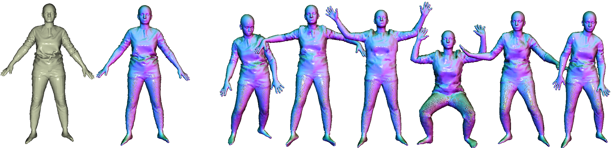

## The Power of Points for Modeling Humans in Clothing (ICCV 2021)

[](https://arxiv.org/abs/2109.01137)

This repository contains the official PyTorch implementation of the ICCV 2021 paper:

**The Power of Points for Modeling Humans in Clothing** <br>
Qianli Ma, Jinlong Yang, Siyu Tang, and Michael J. Black <br>[Paper](https://ps.is.tuebingen.mpg.de/uploads_file/attachment/attachment/655/POP_camera_ready.pdf) | [Supp](https://ps.is.tuebingen.mpg.de/uploads_file/attachment/attachment/656/POP_supp.pdf) | [Video](https://youtu.be/5M4F9zSWIEE) | [Project website](https://qianlim.github.io/POP.html) | [Dataset](https://pop.is.tue.mpg.de/)




## Installation

- This repository is based on our prior work, [SCALE](https://github.com/qianlim/SCALE). If you have successfully run the SCALE code before, you can use the same virtual environment and skip this section.

- The code has been tested with python 3.6 on Ubuntu 18.04 + CUDA 10.0.

- First, in the folder of this repository, run the following commands to create a new virtual environment and install dependencies:

  ```bash
  python3 -m venv $HOME/.virtualenvs/POP
  source $HOME/.virtualenvs/POP/bin/activate
  pip install -U pip setuptools
  pip install -r requirements.txt
  ```
  
- Install the Chamfer Distance package (MIT license, taken from [this implementation](https://github.com/krrish94/chamferdist/tree/97051583f6fe72d5d4a855696dbfda0ea9b73a6a)). Note: the compilation is verified to be successful under CUDA 10.0, but may not be compatible with later CUDA versions. 

  ```bash
  cd chamferdist
  python setup.py install
  cd ..
  ```

- You are now good to go with the next steps! All the commands below are assumed to be run from the `POP` repository folder, within the virtual environment created above. 


## Run POP

### Download pre-trained models and data

- Create the checkpoints and data folders: `mkdir checkpoints data`.
- Download our [pre-trained model weights](https://owncloud.tuebingen.mpg.de/index.php/s/3zy6YmWKWDBQAiK), unzip and place them under the `checkpoints` folder. There are two pre-trained model folders, one trained with the [ReSynth data](https://pop.is.tue.mpg.de/) one trained with the [CAPE data](https://cape.is.tue.mpg.de/dataset.html).
For example, the checkpoints' path for the ReSynth-pretrianed model will be `checkpoints/POP_pretrained_ReSynthdata_12outfits/<.pt checkpoint files>`.
- Download the packed data for demo from the [ReSynth dataset](https://pop.is.tue.mpg.de/).

  - After a simple registration, go to the "Download" tab and choose the "Option 1" (POP_demo_data) there. Download both "packed packed npz files" and "high-res point clouds", unzip respectively to the `data/resynth` folder. 
  - The data file paths should look like `data/resynth/packed/<outfit_name>/<train,test,val split>/<npz files>`.

### Run inference

With the data and pre-trained model ready, run the following command:

```bash
python main.py --config configs/config_demo.yaml --mode test
```

The command will:

- Test the model on both `seen` (the outfit is seen during training the pre-trained model, but the test poses are unseen) and `unseen` (both the outfit and the test poses are unseen) scenarios. 

- Generate sequences of animated clothed human point clouds (`.ply` files) in various subfolders under `results/saved_samples/POP_pretrained_ReSynthdata_12outfits/`.

**Remark:** The results from the `unseen` scenario is that of the **single scan animation**. When testing on the unseen outfits, the code will first take a single scan from the unseen outfit data, optimize the geometric feature tensor w.r.t. it, and then animate according to the given query poses. See command line outputs for more detailed information.

### Visualize the results

To render images of the point sets generated as above, run the following command: 

```bash
python render/o3d_render_pcl.py --name POP_pretrained_ReSynthdata_12outfits --case seen --query_resolution 256
```

The rendered images of each outfit will be saved under their respective subfolders under `results/rendered_imgs/POP_pretrained_ReSynthdata_12outfits/`. 

### Notes

- Each model (experiment) should be given a unique `name` by passing the `--name` flag to the code. The name is used for reading the seen/unseen outfit configurations in the config files and for the I/O of checkpoints, evaluation results, TensorBoard logs, etc. In the provided example above, the `name` is `POP_pretrained_ReSynthdata_12outfits`.  
- Make sure the `name` is consistent with the key specified in `configs/clo_config.yaml` so that the right definitions of the seen/unseen outfits can be found.
- The code reads a model configuration file (`configs/config_demo.yaml` in the example above) and an outfit configuration file (`configs/clo_config.yaml`). The model configuration file takes care of all settings regarding architecture/training/evaluation. The outfit configuration file defines which outfits are seen/unseen during training. Modify them accordingly to your needs.
- All the model arguments can either be passed by appending flags to the command line (see commands above as an example), or specifying them in the config yaml file. It's also possible to combine both; in case of a conflict, the flags passed in the command line will override those specified in the yaml.


## Train POP

### Training demo with our data examples

- Download our simulated ReSynth dataset from [our dataset website](https://pop.is.tue.mpg.de/). The data is accessible after a simple registration. There, you have the options to download either the entire dataset (~10G * 24 outfits) or a curated small subset to quickly try out the codes.

- Assume the packed demo data is downloaded from under `data/resynth/packed/` as described in the previous section. Now run:

  ```bash
  python main.py --config configs/config_train_demo.yaml
  ```

  The training will start! 

- The code will save the loss curves in the TensorBoard logs under `tb_logs/<date>/POP_train_demo_ReSynthData`.

- Examples from the validation set at every N (default: 10) epochs will be saved at `results/saved_samples/POP_train_demo_ReSynthData/val`.

### Training with your own data

- We will provide the data pre-processing and packing codes for your custom data soon (ETA: end of October 2021).


## License

Software Copyright License for non-commercial scientific research purposes. Please read carefully the [terms and conditions](./LICENSE) and any accompanying documentation before you download and/or use the POP code, including the scripts, animation demos and pre-trained models. By downloading and/or using the Model & Software (including downloading, cloning, installing, and any other use of this GitHub repository), you acknowledge that you have read these terms and conditions, understand them, and agree to be bound by them. If you do not agree with these terms and conditions, you must not download and/or use the Model & Software. Any infringement of the terms of this agreement will automatically terminate your rights under this [License](./LICENSE).

The SMPL/SMPL-X body related files (including all `.obj` files, uv masks and barycentric coordinate values under the `assets/` folder) are subject to the license of the [SMPL model](https://smpl.is.tue.mpg.de/) / [SMPL-X model](https://smpl-x.is.tue.mpg.de/). The provided demo data (including the body pose and the meshes of clothed human bodies) are subject to the license of the [CAPE Dataset](https://cape.is.tue.mpg.de/). The Chamfer Distance implementation is subject to its [original license](./chamferdist/LICENSE).


## Citations

If you find the codes of this work or the associated ReSynth dataset helpful to your research, please consider citing:

```bibtex
@inproceedings{POP:ICCV:2021,
title = {The Power of Points for Modeling Humans in Clothing},
author = {Ma, Qianli and Yang, Jinlong and Tang, Siyu and Black, Michael J.},
booktitle = {Proceedings of the IEEE/CVF International Conference on Computer Vision (ICCV)},
month = oct,
year = {2021},
month_numeric = {10}}
```


## Related Research

[SCALE: Modeling Clothed Humans with a Surface Codec of Articulated Local Elements (CVPR 2021)](https://qianlim.github.io/SCALE)<br>
*Qianli Ma, Shunsuke Saito, Jinlong Yang, Siyu Tang, Michael J. Black*

Our previous point-based model for humans: modeling pose-dependent shapes of clothed humans explicitly with hundreds of articulated surface elements: the clothing deforms naturally even in the presence of topological change.

[SCANimate: Weakly Supervised Learning of Skinned Clothed Avatar Networks (CVPR 2021)](https://scanimate.is.tue.mpg.de/)<br>
*Shunsuke Saito, Jinlong Yang, Qianli Ma, Michael J. Black*

Our *implicit* solution to pose-dependent shape modeling: cycle-consistent implicit skinning fields + locally pose-aware implicit function = a fully animatable avatar with implicit surface from raw scans without surface registration!

[Learning to Dress 3D People in Generative Clothing (CVPR 2020)](https://cape.is.tue.mpg.de/)<br>
*Qianli Ma, Jinlong Yang, Anurag Ranjan, Sergi Pujades, Gerard Pons-Moll, Siyu Tang, Michael J. Black*

CAPE --- a generative model and a large-scale dataset for 3D clothed human meshes in varied poses and garment types. 
We trained POP using the [CAPE dataset](https://cape.is.tue.mpg.de/dataset), check it out!
